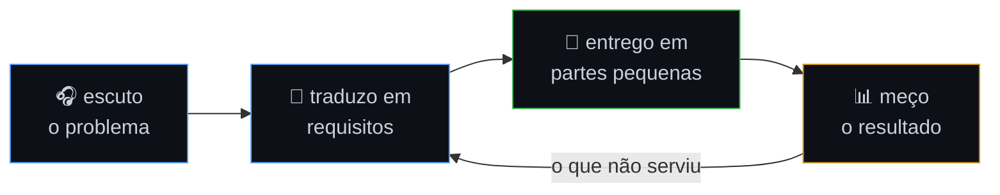

  

  <a href="https://plc232007.github.io/portifolio-pedro/"><b>Portfólio</b></a> ·
  <a href="https://www.linkedin.com/in/pedro-leite-campos">LinkedIn</a> ·
  <a href="mailto:pleitecampos@gmail.com">E-mail</a>

  <b>Da primeira conversa ao software em uso.</b> 
  Desenvolvimento fullstack com atenção aos requisitos, às regras de negócio e a quem usa o produto.

---

### 👋 Prazer, Pedro

Minha entrada na tecnologia foi pela **análise de requisitos**. Hoje, levo essa perspectiva para o desenvolvimento: entender o contexto, organizar as regras e transformar uma necessidade em algo que possa ser usado e melhorado.

Por aqui, você encontra geometria interativa, ferramentas para comunidades, organização financeira e experimentos com agentes de IA. O ponto em comum é a vontade de conectar código a problemas concretos.

> **Meu ponto de partida:** quem vai usar, qual problema precisa resolver e como saber se a entrega funcionou?

### 🧭 Como eu construo

| Etapa | O que guia o trabalho |
|---|---|
| **01 · Entender** | Ouvir o problema, identificar quem usa e esclarecer as restrições. |
| **02 · Dar forma** | Traduzir a conversa em requisitos, regras e critérios de aceite. |
| **03 · Construir** | Dividir a solução em entregas pequenas, conectando interface, lógica e dados. |
| **04 · Aprender** | Observar o resultado e usar o retorno para ajustar a próxima entrega. |

Vim da análise de requisitos antes de virar dev — por isso o loop começa em escutar, não em codar.

---

### 🚀 Projetos em destaque

#### 📐 LVM · Matemática que dá para explorar

Geometria manipulável e exercícios gerados por semente: uma proposta para explorar os conceitos e praticar além de um gabarito fixo.

- **No produto:** interação com representações geométricas e variação dos exercícios.
- **Na implementação:** `Next.js` · `TypeScript` · `Mafs` · `fast-check`.
- **Detalhe técnico:** a geração por semente permite reproduzir um exercício; o uso de `fast-check` traz testes baseados em propriedades para o projeto.

[Explorar aplicação ↗](https://lvm-seven.vercel.app) · [Ver código](https://github.com/plc232007/lvm)

#### 📚 App dos Catequistas · Tecnologia a serviço da comunidade

Uma aplicação para apoiar o trabalho dos catequistas, com cerca de **70 usuários reais** e controle de acesso aos dados.

- **No produto:** uma ferramenta voltada à rotina de uma comunidade.
- **Na implementação:** `React` · `Supabase` · `PostgreSQL`.
- **Detalhe técnico:** permissões com **Row Level Security**, aplicadas no acesso às linhas do banco de dados.

[Conhecer aplicação ↗](https://app-catequese-taupe.vercel.app) · [Ver código](https://github.com/plc232007/app-catequese)

#### 💰 Organizador de Contas · Um lugar para as finanças da família

Organização financeira com isolamento de dados e experiência instalável como **PWA**.

- **No produto:** contas da família reunidas em uma aplicação que pode ser instalada no dispositivo.
- **Na implementação:** `Next.js 16` · `shadcn/ui` · `Zod`.
- **Detalhe técnico:** isolamento dos dados financeiros, componentes de interface e validação de dados compõem a solução.

[Abrir aplicação ↗](https://organizador-contas-et4n.vercel.app/) · [Ver código](https://github.com/plc232007/organizador-contas)

#### 🤖 FactoryFlow AI · Do requisito ao pipeline de agentes

Um laboratório de automação no qual um requisito em texto percorre um pipeline multiagente para gerar especificação, código e testes.

- **No experimento:** conectar etapas do desenvolvimento em um fluxo de agentes.
- **Na implementação:** `Python` · `Agents SDK` · `pytest`.
- **O que explora:** a passagem de uma intenção em linguagem natural para artefatos de desenvolvimento.

[Explorar o laboratório ↗](https://github.com/plc232007/factoryflow-ai)

---

<b>🧪 Outras bancadas do laboratório · mais 4 projetos</b>

 

- **[Anime Finance](https://github.com/plc232007/anime-finance)** — Django REST + JWT + React, fullstack de ponta a ponta
- **[Sabor Express](https://github.com/plc232007/sabor-express)** · [ver](https://sabor-express-eight.vercel.app/) — uma camada de regras, duas interfaces (terminal e Flask)
- **[Catálogo Naty](https://github.com/plc232007/catalogo-naty)** · [ver](https://catalogo-naty.vercel.app/) — vitrine e estoque pra uma empreendedora real
- **[c-learning](https://github.com/plc232007/c-learning)** — ponteiros, alocação e estruturas de dados do zero

### 🧰 Minha caixa de ferramentas

| Camada | Tecnologias | Onde entram |
|---|---|---|
| **Interfaces** | TypeScript, React, Next.js | Telas, interações e aplicações web. |
| **Backend** | Python, Django, PHP, Laravel | APIs e regras de negócio. |
| **Dados** | PostgreSQL, Supabase | Persistência e controle de acesso. |
| **Qualidade** | pytest, fast-check, Zod | Testes e validação de dados. |
| **Fundamentos e experimentos** | C, Agents SDK | Estruturas de dados e fluxos com agentes. |

<b>Ver as tecnologias em badges</b>

 

---

### 💬 Vamos conversar?

Tem uma ideia, um problema para resolver ou quer trocar experiências sobre algum projeto? Me conte o contexto — essa é a minha parte favorita para começar.

**[Conheça meu portfólio ↗](https://plc232007.github.io/portifolio-pedro/)** · [Conecte-se no LinkedIn](https://www.linkedin.com/in/pedro-leite-campos) · [Escreva um e-mail](mailto:pleitecampos@gmail.com)

Entender → construir → colocar em uso → aprender → repetir.

