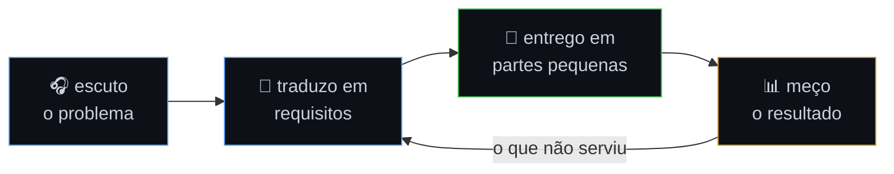

  

  <a href="https://plc232007.github.io/portifolio-pedro/"><b>Portfólio</b></a> ·
  <a href="https://www.linkedin.com/in/pedro-leite-campos">LinkedIn</a> ·
  <a href="mailto:pleitecampos@gmail.com">E-mail</a>

---

### Como eu construo

Vim da análise de requisitos antes de virar dev — por isso o loop começa em escutar, não em codar.

---

### Em produção

| | Projeto | O que resolve | Stack |
|:-:|---|---|---|
| 📐 | **[LVM](https://github.com/plc232007/lvm)** · [ver](https://lvm-seven.vercel.app) | Geometria manipulável, exercícios gerados por semente — sem gabarito pra decorar | `Next.js` `TS` `Mafs` `fast-check` |
| 📚 | **[App dos Catequistas](https://github.com/plc232007/app-catequese)** · [ver](https://app-catequese-taupe.vercel.app) | ~70 usuários reais, acesso controlado por Row Level Security | `React` `Supabase` `Postgres` |
| 💰 | **[Organizador de Contas](https://github.com/plc232007/organizador-contas)** · [ver](https://organizador-contas-et4n.vercel.app/) | Finanças da família com isolamento real de dados, instalável como PWA | `Next.js 16` `shadcn/ui` `Zod` |
| 🤖 | **[FactoryFlow AI](https://github.com/plc232007/factoryflow-ai)** | Pipeline multiagente: requisito em texto vira spec, código e testes | `Python` `Agents SDK` `pytest` |

<b>Mais projetos e laboratórios</b>

 

- **[Anime Finance](https://github.com/plc232007/anime-finance)** — Django REST + JWT + React, fullstack de ponta a ponta
- **[Sabor Express](https://github.com/plc232007/sabor-express)** · [ver](https://sabor-express-eight.vercel.app/) — uma camada de regras, duas interfaces (terminal e Flask)
- **[Catálogo Naty](https://github.com/plc232007/catalogo-naty)** · [ver](https://catalogo-naty.vercel.app/) — vitrine e estoque pra uma empreendedora real
- **[c-learning](https://github.com/plc232007/c-learning)** — ponteiros, alocação e estruturas de dados do zero

<b>Stack completa</b>

 

